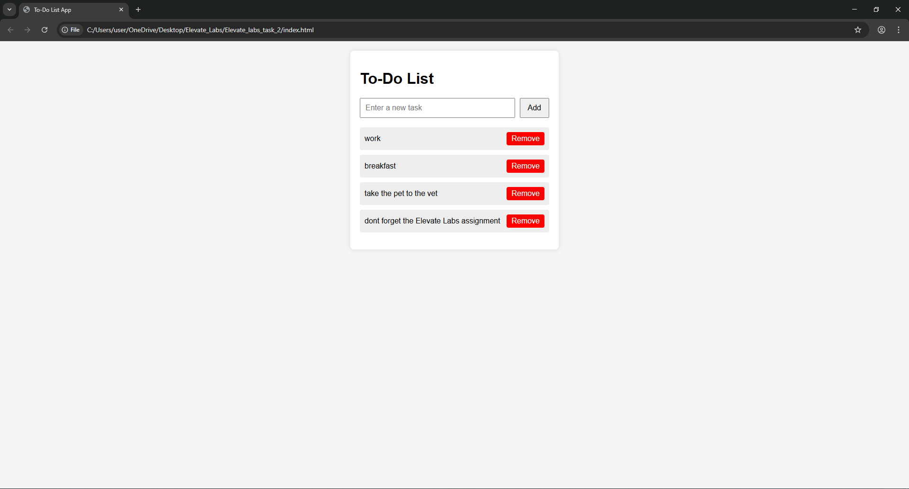

# Elevate_labs_task_2
Building a To-Do List Web App (Front-end only, using Vanilla JavaScript)

# To-Do List Web App

This is a simple front-end To-Do List application built using HTML, CSS, and Vanilla JavaScript.

## Features
- Add new tasks
- Mark tasks as complete
- Remove tasks
- Instant UI updates without page reload

## How to Run
1. Open `index.html` in a browser (use Live Server in VS Code for best experience).
2. Type a task and click "Add".
3. Click a task to mark it complete.
4. Click "Remove" to delete a task.

## Learning Outcomes
- DOM manipulation
- Event handling
- JavaScript ES6 features

